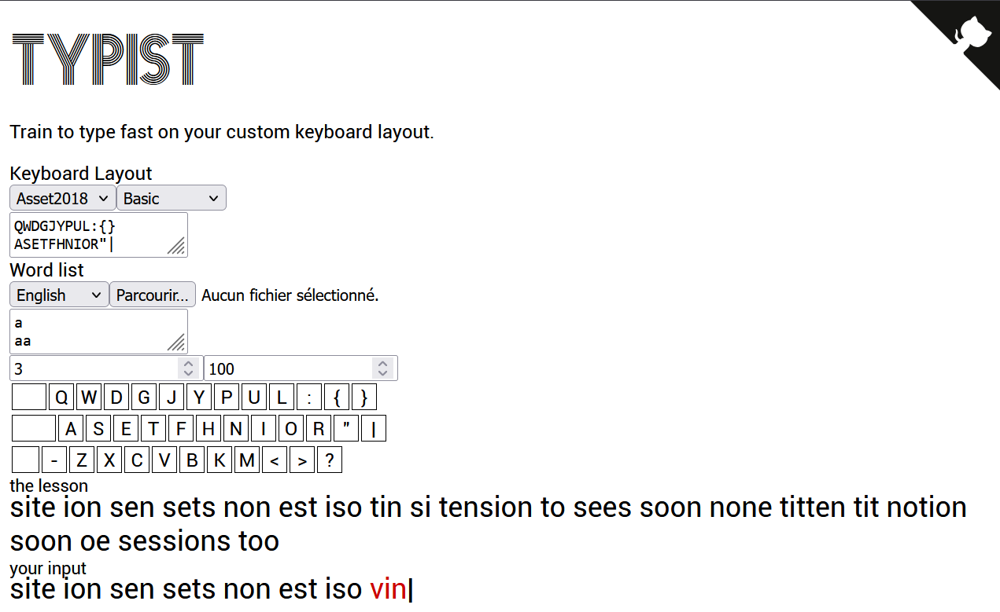

# [Custom Typist](https://typist.ea9c.com/)

Typist is a keyboard typing training tool for Custom Keyboard Layouts. You
quickly describe your keyboard layout and the tool will create lessons just
for that layout, starting by the index keys of home row and progressively
adding more keys of the home row, then expanding to the upper and lower row.

## Roadmap

### Goal 1

Read a keyboard from the user and display it in a table of tables

### Goal 2

Detect keypresses and highlight the pressed keys

### Goal 3

Produce lessons adapted to the keyboard of the user

### Goal 4

Write down what the user types as they type it and track errors in its text

### Goal 5

Produce lessons in English and French-without-accents and custom dictionnary,
but without accent.

### Goal 6

Support secondary symbols on keyboard keys

### Goal 7

Produce lessons in French

### Goal 8

Allow the user to provide their own dictionnary of words from their language
and produce lessons based off of it.

### Goal 9

Add a mode which adds punctuations `;:,.!?'"/()[]` to the text.

### Goal 10

Add a mode which adds programmer punctuations `!@#$%^&*-=~_+;:,./?'"\|()[]{}<>`
to the text.
